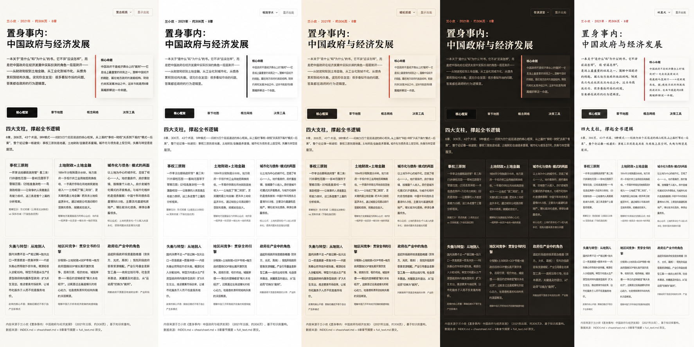
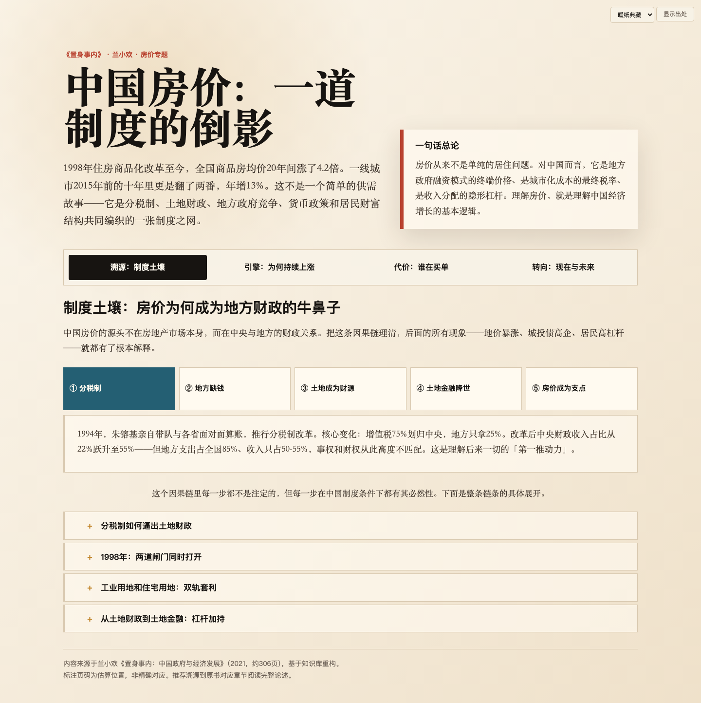
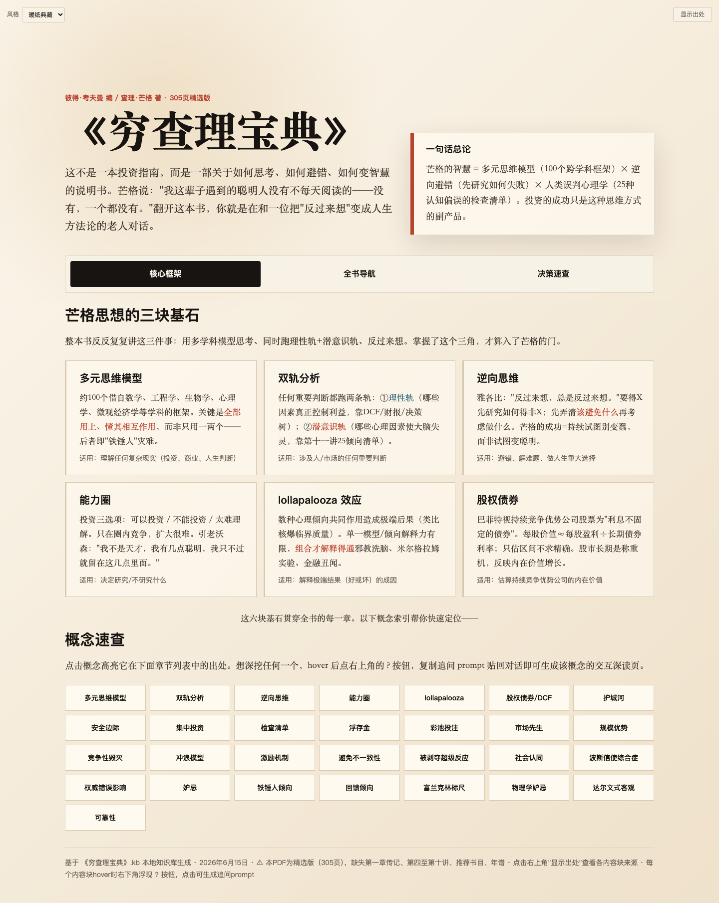

# 📖 book-to-webpage

> 把一本书，变成可交互的 HTML 学习页 —— 可点击、可探索、可追问，6 套精美主题一键换肤。


[](https://opensource.org/licenses/MIT)
[](https://claude.ai/code)
[]()
[]()

---

## 目录

- [这是什么？](#这是什么)
- [效果一览](#效果一览)
- [快速开始](#快速开始)
- [工作原理](#工作原理)
- [交互组件](#交互组件)
- [主题系统](#主题系统)
- [响应式设计](#响应式设计)
- [出处标注](#出处标注)
- [追问功能](#追问功能)
- [自动验证](#自动验证)
- [支持的格式](#支持的格式)
- [与 book-to-skill 的关系](#与-book-to-skill-的关系)
- [文件结构](#文件结构)
- [贡献](#贡献)
- [许可](#许可)

---

## 这是什么？

**book-to-webpage** 是一个 Claude Code Skill。你把一本书（PDF、EPUB、Markdown...）交给它，它分两步工作：

| 阶段 | 做什么 | 产出 |
|:---:|--------|------|
| **① 拆书** | 从头到尾读透全书，提取结构、框架、术语、模式 | `<书名>.kb/` 本地知识库 |
| **② 生成页面** | 根据你的请求（某个主题 / 全书概述 / 某一章），生成交互 HTML | 单文件 `.html` + `.md` |

它不是那种干巴巴的 AI 摘要。它把书里的知识重组为**可点击、可探索的网页**——因果链可以一步步点开、时间线可以纵向浏览、概念之间可以跳转，每一处都标着出自书里哪一页。

### 核心理念

> **展示层是核心差异化。** 不是做读书摘要，而是把书中某个主题做成可交互的叙事网页。组件可点击，内容成故事。

---

## 效果一览

### 6 套主题，一键换肤

同一本书、同一段内容，6 种截然不同的阅读气质。页面右上角下拉菜单实时切换，选择自动记忆。

<p align="center">
  
</p>

<p align="center">
  <em>6 套主题一览：暖纸典藏 / 极简学术 / 夜读深空 / 东方水墨 / 复古编辑 / 纸墨风</em>
</p>

### 主题深度页 & 全书概览

<table>
<tr>
<td width="50%">
  
  <p align="center"><em>主题深度页 — 因果链 + 时间线交互</em></p>
</td>
<td width="50%">
  
  <p align="center"><em>全书概览 — 框架卡片 + 章节地图</em></p>
</td>
</tr>
</table>
## 快速开始

### 1. 安装

```bash
git clone https://github.com/YOUR_USERNAME/book-to-webpage.git ~/.claude/skills/book-to-webpage/
```

安装 PDF 提取依赖（可选，按需）：

```bash
# macOS
brew install poppler          # pdftotext（推荐，中文支持最好）

# 或 pip
pip3 install pypdf2 pdfminer.six ebooklib python-docx beautifulsoup4 striprtf
```

### 2. 使用

在 Claude Code 中直接对话即可：

```
# 第一次处理一本书 → 拆解全书
/book-to-webpage 《置身事内》.pdf

# 已有知识库后 → 生成主题页面
/book-to-webpage 用置身事内的内容解释中国房价的发展

# 全书概览
/book-to-webpage 概述一下《穷查理宝典》

# 指定主题风格
/book-to-webpage 用极简风格做一页关于债务周期的分析
```

---

## 工作原理

### 阶段 1：拆书 → 知识库

```
📄 书文件 (PDF/Markdown/EPUB/...)
        │
        ▼
 extract.py 提取全文
        │
        ▼
 full_text.txt + metadata.json（页数/字数/token）
        │
        ▼
 REPL 式切片拆解（逐章处理，大书不爆上下文）
        │
        ▼
┌─────────────────────────────────┐
│  <书名>.kb/                     │
│  ├── INDEX.md        ← 知识库导航│
│  ├── chapters/       ← 章节摘要  │
│  ├── glossary.md     ← 术语表    │
│  ├── patterns.md     ← 模式库    │
│  ├── cheatsheet.md   ← 决策规则  │
│  ├── full_text.md    ← 原文全文  │
│  └── metadata.json   ← 元数据    │
└─────────────────────────────────┘
```

每章摘要包含：核心思想、引入的框架、关键概念、心智模型、反模式、案例演算、要点、章节关联。

### 阶段 2：请求 → 网页

```
用户请求（"解释中国房价"）
        │
        ▼
 ┌──────────────┐
 │ 判定请求模式   │
 │ ① 全书概述    │
 │ ② 主题聚合 ←  │
 │ ③ 单章深读    │
 └──────┬───────┘
        │
        ▼
 两级检索（章节摘要 + grep 原文）
        │
        ▼
 重组为流畅叙事（去重、归类、改写、补衔接）
        │
        ▼
 结构化为 JSON → 挑选交互组件
        │
        ▼
 ┌──────────────────────────┐
 │ 三层渲染                  │
 │ ① 骨架（base.html）       │
 │ ② 组件（components.md）   │
 │ ③ 衔接（Agent 现写引语）   │
 └──────────┬───────────────┘
            │
            ▼
 单文件 HTML + 同步 Markdown
```

### 两级检索机制（主题聚合的核心差异化）

```
第一级（结构化）
  → 读 chapters/ 里的章节摘要
  → 框架、概念、反模式等结构化要点
  → 保结构

第二级（原汁原味）
  → grep full_text.md 原文散落表述
  → 具体论述 + 作者原话 + 数据
  → 保全面

合并 → 去重归类 → 改写重组 → 补衔接句 → 流畅叙事
```

---

## 交互组件

页面不是静态文本堆砌。根据内容的**逻辑结构**，自动挑选最合适的交互组件。

### 主题页面组件（11 种）

| 组件 | 适用场景 | 交互方式 |
|------|---------|---------|
| 🔗 **因果链探索器** | "A→B→C→D" 因果推进 | 点击节点展开详细解释 |
| 🏷️ **类型选择器** | 多类别并列比较 | 点击类型切换分析面板 |
| 📊 **对比矩阵** | 多选项多维度对比 | hover 高亮整行，视觉打分 |
| 📅 **时间线** | 历史演进、事件序列 | 纵向时间轴，逐步展开 |
| 🌲 **决策树** | "如果 X 则 Y" 条件分叉 | `<details>` 折叠/展开 |
| 📖 **案例叙事卡** | 用具体故事讲抽象逻辑 | 带洞察标注的故事卡片 |
| ⚖️ **前后对比** | 政策/事件前后状态比较 | 双栏对照，「之前」「之后」 |
| 📑 **分层揭示** | 先给结论再给论证 | `<details>` 折叠，控制密度 |
| 💬 **原话引用** | 需要保留作者精确表述 | 引号装饰 + 出处 + 冲击力 |
| ❓ **问题清单** | 读者自检，知识→行动 | 卡片列表，带引导提示 |
| 🔍 **追问按钮** | 每个内容块内置 | hover 浮现 → 点击弹窗 → 追问 |

### 概述页面组件（4 种）

- **核心框架卡片网格** — 最重要的命名框架，一张卡片一个
- **章节结构地图** — 按 Part 分组的章节列表，每章标注角色
- **概念关联图** — 点概念按钮，高亮出现该概念的所有章节
- **决策规则速览** — "当 X 时做 Y，因为 Z"，来自 cheatsheet

### 组件挑选逻辑

不是简单映射。Agent 先判断内容的**主要逻辑结构**，再做选择：

| 内容性质 | 首选组件 | 备选 |
|---------|---------|------|
| 因果推进 | `causal_chain` | accordion |
| 历史演进 | `timeline` | story_card |
| 多类别并列 | `type_selector` | matrix |
| 多维权衡 | `matrix` | before_after |
| 条件分叉 | `decision_tree` | accordion |
| 案例叙事 | `story_card` | quote_card |
| 制度变迁 | `before_after` | timeline |
| 核心论述 | `accordion` | decision_tree |
| 重要原话 | `quote_card` | story_card |
| 读者自检 | `questions` | decision_tree |

---

## 主题系统

页面布局和交互**完全不变**，只通过 CSS 变量换皮。6 套主题全部内联在 HTML 中，右上角下拉菜单实时切换。

| 主题 ID | 中文名 | 字体气质 | 底色 | 强调色 | 适合场景 |
|---------|--------|---------|------|--------|---------|
| `warm-paper` | 暖纸典藏 | 宋体正文 + 标题黑体 | 暖纸 `#f8f2e7` | 朱红/岩蓝/松绿/金 | **默认**，社科/人文通读 |
| `minimal` | 极简学术 | 全无衬线 | 纯白 | 单一岩蓝 | 学术论文、技术文档 |
| `dark` | 夜读深空 | 宋体 + 暖白字 | 深墨 `#1a1a1a` | 柔金/暖橙 | 夜间长文阅读 |
| `ink-wash` | 东方水墨 | 宋体 + 留白 | 宣纸白 | 朱砂红 | 中国主题、历史、哲学 |
| `vintage-editorial` | 复古编辑 | 无衬线，大写标题 | 奶油 `#faf7f2` | 砖红 | 杂志风格、评论文章 |
| `paper-ink` | 纸墨风 | 楷体正文 | 暖米纸 | 猩红 + 装饰符号 | 文学、传记、散文 |

### 换肤机制

```css
/* :root = 暖纸典藏（默认主题变量） */
:root {
  --font-body: "Songti SC", Georgia, serif;
  --font-display: "PingFang SC", system-ui, sans-serif;
  --bg: radial-gradient(...), linear-gradient(...);
  --surface: #faf6ee;
  --ink: #2c2416;
  --red: #b9422f;
  --blue: #245f73;
  --green: #4a7c59;
  --gold: #b49450;
  /* ...共 40+ 个变量 */
}

/* 5 个 [data-theme="X"] 覆盖块 */
[data-theme="dark"] {
  --bg: #1a1a1a;
  --surface: #2a2a2a;
  --ink: #e8dcc8;
  --red: #e8a87c;
  /* ...覆盖全部变量 */
}

[data-theme="ink-wash"] { /* ... */ }
[data-theme="minimal"] { /* ... */ }
[data-theme="vintage-editorial"] { /* ... */ }
[data-theme="paper-ink"] { /* ... */ }
```

`<body data-theme="...">` 控制当前生效主题，localStorage 记忆选择。

---

## 支持的格式

| 格式 | 解析器 | 安装方式 |
|------|--------|---------|
| PDF | pdftotext（推荐，中文最佳） | `brew install poppler` |
| PDF | pypdf2 | `pip3 install pypdf2` |
| PDF | pdfminer.six | `pip3 install pdfminer.six` |
| EPUB | ebooklib | `pip3 install ebooklib` |
| DOCX | python-docx | `pip3 install python-docx` |
| TXT | 内置 | 无需安装 |
| Markdown | 内置 | 无需安装 |
| HTML | beautifulsoup4 | `pip3 install beautifulsoup4` |
| RTF | striprtf | `pip3 install striprtf` |
| MOBI/AZW | Calibre `ebook-convert` | `brew install calibre` |

```bash
# 诊断各格式解析器状态
python3 scripts/extract.py --check
```

## 文件结构

```
book-to-webpage/
├── SKILL.md                    # Skill 定义（Agent 执行指令，约 20K）
├── README.md                   # 本文件
├── assets/
│   └── screenshots/            # 截图（文档用）
│       ├── theme-warm-paper.png
│       ├── theme-minimal.png
│       ├── dark-theme.png
│       ├── theme-deepdive.png
│       ├── overview-mode.png
│       ├── mobile-responsive.png
│       ├── all-themes-showcase.png
│       └── style-showcase-*.png
├── templates/
│   ├── base.html               # ① 骨架层：页面壳 + CSS 变量 + 布局 + 追问/出处切换 JS
│   ├── components.md           # ② 组件层：11 种组件的 HTML/CSS/JS 范式 + 数据槽位
│   └── themes/                 # ③ 主题层：6 套 CSS 主题 + 目录说明
│       ├── README.md
│       ├── warm-paper.css      # 暖纸典藏（默认）
│       ├── minimal.css         # 极简学术
│       ├── dark.css            # 夜读深空
│       ├── ink-wash.css        # 东方水墨
│       ├── vintage-editorial.css # 复古编辑
│       └── paper-ink.css       # 纸墨风
├── scripts/
│   ├── extract.py              # 提取器入口（支持 9+ 格式）
│   ├── extractor/              # 提取器包（PDF/EPUB/DOCX/…）
│   └── verify-page.js          # Playwright 自动验证脚本
└── examples/
    ├── theme-preview/           # 4 套主题预览 HTML（可浏览器直接打开）
    │   ├── README.md
    │   ├── warm-paper.html
    │   ├── minimal.html
    │   ├── dark.html
    │   └── ink-wash.html
    └── 置身事内-房地产启示.html
```

## 许可

MIT License

---

<p align="center">
  <sub>Made with ❤️ for readers who want to <strong>interact</strong> with books, not just read summaries.</sub>
</p>
