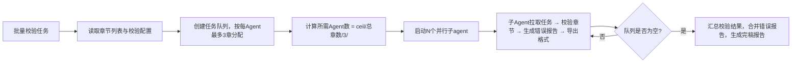

## 网文完稿校验

### 触发关键词
小说写完了帮我检查下、导出适合起点/番茄的格式、查有没有错别字、检测敏感词、整理成发布版本、帮我导出小说发布格式、检查小说错别字、敏感词检测、小说完稿检查、适配起点格式导出、番茄小说格式导出、小说排版整理、多平台格式导出、小说完稿导出

### 核心功能
1. 错别字、标点符号、语法错误检查
2. 敏感内容、违规内容排查
3. 格式规范统一：章节标题、段落格式、标点规范
4. 全文字数统计、完稿报告生成
5. 适配不同平台发布格式导出
6. 批量替换功能
7. 自动分段功能
8. **Obsidian 导出**：将拆书笔记、创作复盘、项目文档导出到 Obsidian Vault

> **Skill 边界说明**：技术性文字校验（错别字/标点/语法）由本 Skill 负责，`sumeru-polish` Skill 专注于文笔和内容层面的优化，两者互补不重叠。用户在润色后仍应通过 finalize 进行最终技术校验。

### 子Agent并行校验机制

当需要校验/导出的章节数量大于3章时，自动启用子Agent并行处理模式：

**⚠️ 遵循全局约束：每个子Agent最多负责3个章节**（详见 AGENTS.md "子Agent并行处理规则"）
- 所需Agent数 = ceil(总章节数 / 3)
- 相邻章节分配给同一Agent，保持格式处理一致性

**调度逻辑**


**章节分配规则**
- 按章节顺序连续分配（如Agent1负责第1-3章，Agent2负责第4-6章）
- 尾部不足3章的Agent按实际剩余章节数分配

**每个子Agent的校验范围**
- 错别字、标点、语法错误检查
- 敏感词检测（按三级标准）
- 格式规范统一
- 对应平台格式导出

### 输出内容
- 错误列表：错别字、标点错误、语法问题
- 敏感内容提示：需要调整的违规内容
- 校验后的纯净版全文
- 完稿报告：总字数、章节数、核心内容摘要
- 多平台发布格式版本（起点、番茄、晋江等）
- **Obsidian 导出包**：拆书笔记、创作复盘、项目文档（可选）

### 各平台导出格式规则

#### 起点中文网（qidian）
- 章节标题格式：`第X章 标题内容`，居中对齐
- 段落首行缩进2字符
- 每段空一行
- 标点符号使用中文全角
- 章节字数建议3000-5000字
- 禁止使用特殊符号作为章节标题
- 对话单独成段

#### 番茄小说（fanqie）
- 章节标题格式：`第X章 标题内容`
- 段落首行不缩进，段落间空一行
- 每句尽量简短，适合移动端阅读
- 章节字数建议2000-3000字
- 重点内容可使用加粗标记
- 对话使用引号包裹，说话人单独成段或句尾注明

#### 晋江文学城（jjwxc）
- 章节标题格式：`第X章 标题内容`
- 支持HTML格式标签
- 段落首行缩进2字符
- 章节字数建议2500-4000字
- 作者有话要说区域单独设置
- 支持章节提要

#### 纵横中文网（zongheng）
- 章节标题格式：`第X章 标题内容`
- 段落首行缩进2字符
- 章节字数建议3000-6000字
- 支持分卷设置
- 标点规范使用中文全角

#### 17K小说网（17k）
- 章节标题格式：`第X章 标题内容`
- 段落首行缩进2字符
- 章节字数建议2000-4000字
- 支持章节预览
- 每章结束可设置下章预告

### 敏感词检测标准

#### 一级敏感（必须修改）
- 违反国家法律法规的内容
- 涉及政治敏感人物、事件
- 色情、淫秽描写
- 暴力、恐怖内容
- 分裂国家、破坏民族团结言论
- 宗教极端内容

#### 二级敏感（建议修改）
- 过于血腥暴力的细节描写
- 低俗用语、粗口
- 可能引起不适的医疗描写
- 涉及未成年人的不当内容
- 赌博、毒品相关描写
- 侵犯他人隐私的内容

#### 三级敏感（优化建议）
- 网络用语过多影响阅读
- 容易产生歧义的表述
- 可能引起争议的话题
- 过度使用网络热梗
- 重复冗余的表述

### 错误分级提示

#### 严重错误（红色标记）
- 错别字导致语义完全改变
- 敏感词一级违规内容
- 章节标题格式完全不符合规范
- 段落结构严重混乱
- 标点符号大面积错误

#### 中等错误（黄色标记）
- 一般错别字
- 标点符号使用不规范
- 敏感词二级内容
- 段落格式不统一
- 语法错误影响理解

#### 轻微错误（蓝色标记）
- 建议优化的用词
- 标点符号使用可以更规范
- 敏感词三级内容
- 段落排版可进一步美化
- 重复性表述建议

### 批量替换功能说明

#### 功能特性
- 支持全局批量替换指定词汇
- 支持正则表达式替换
- 支持替换前预览确认
- 支持多组替换规则同时执行
- 支持替换历史记录查询

#### 使用场景
1. 角色名统一修改
2. 地名、设定名称批量调整
3. 敏感词批量替换
4. 标点符号统一规范
5. 网络用语批量转换

#### 操作方式
- 预设规则：选择常用替换规则模板
- 自定义规则：手动输入查找内容和替换内容
- 正则模式：使用正则表达式进行复杂匹配
- 确认替换：查看替换预览后确认执行

### 自动分段功能说明

#### 功能特性
- 智能识别对话与叙述内容
- 根据句子长度自动分段
- 支持自定义分段字数阈值
- 保持段落逻辑完整性
- 对话自动单独成段

#### 分段规则
1. 对话优先：对话内容自动单独成段
2. 字数控制：单段建议100-300字
3. 逻辑完整：避免在句子中间分段
4. 场景切换：场景转换时自动分段
5. 心理活动：大段心理描写适当分段

#### 可配置参数
- 最大段落字数（默认300字）
- 最小段落字数（默认50字）
- 是否强制对话单独成段
- 是否在场景切换时加分隔线
- 是否保留原有分段结构

### 数据持久化
完稿数据自动保存到 `.sumeru/finalize/` 目录：
- `clean/full-text.md`：校验后的纯净版全文
- `clean/chapters/`：按章节拆分的纯净版文件
- `error-report.json`：错误列表，含错别字、标点、敏感词等所有问题
- `stats.json`：完稿统计报告，总字数、章节数、平均章节长度等
- `export-config.json`：各平台导出配置参数

**用户可见输出（当前工作目录）**：
- `publish/`：各平台导出版本，按平台名分类存放
- `obsidian-export/`：Obsidian 导出包（可选）

### 命令表

| 命令 | 说明 | 示例 |
|------|------|------|
| `/完稿` | 启动完稿校验与导出流程 | `/完稿` |
| `/校验` | 校验错别字、标点、语法错误 | `/校验` |
| `/敏感词检测` | 检测敏感内容、违规内容 | `/敏感词检测` |
| `/导出起点` | 导出适配起点中文网格式 | `/导出起点` |
| `/导出番茄` | 导出适配番茄小说格式 | `/导出番茄` |
| `/导出晋江` | 导出适配晋江文学城格式 | `/导出晋江` |
| `/批量校验` | 批量校验多个章节 | `/批量校验 第1-10章` |
| `/批量替换` | 批量替换指定词汇 | `/批量替换 旧词 新词` |
| `/自动分段` | 智能识别并自动分段 | `/自动分段` |
| `/导出到Obsidian` | 将当前项目导出到 Obsidian Vault | `/导出到Obsidian` |
| `/导出拆书笔记` | 将拆书笔记导出到 Obsidian | `/导出拆书笔记` |
| `/导出复盘报告` | 将创作复盘导出到 Obsidian | `/导出复盘报告` |
| `/同步到Obsidian` | 增量同步更新到 Obsidian | `/同步到Obsidian` |

### 脚本入口

本 skill 通过自然语言触发，无需特定脚本。用户可直接说：
- "小说写完了帮我检查下"
- "导出适合起点/番茄的格式"
- "查有没有错别字"
- "检测敏感词"
- "整理成发布版本"
- "帮我导出小说发布格式"
- "检查小说错别字"
- "敏感词检测"
- "小说完稿检查"
- "适配起点格式导出"
- "番茄小说格式导出"
- "小说排版整理"
- "多平台格式导出"

### Obsidian 导出功能

#### 导出触发条件

当满足以下任一条件时，可触发 Obsidian 导出：
1. **完稿后导出**：小说完稿后，将项目文档导出到 Obsidian
2. **拆书后导出**：拆书完成后，将拆书笔记导出到 Obsidian
3. **复盘后导出**：创作复盘后，将复盘报告导出到 Obsidian
4. **用户手动触发**：`/导出到Obsidian`

#### Obsidian Vault 路径

默认路径：`D:\AI知识库`（用户的 Obsidian Vault）

可通过配置文件 `.sumeru/session/config.json` 修改：
```json
{
  "obsidian": {
    "vaultPath": "D:\\AI知识库",
    "autoExport": false,
    "exportOnComplete": true
  }
}
```

#### 导出目录结构

```
D:\AI知识库\
├── 网文写作/
│   ├── 00-总索引.md
│   ├── 01-方法论/
│   │   └── 小说写作方法论.md
│   ├── 02-拆书笔记/
│   │   ├── 起点/
│   │   └── 番茄/
│   │       ├── 《书名1》.md
│   │       └── 《书名2》.md
│   ├── 03-题材观察/
│   │   └── 都市脑洞-题材分析.md
│   ├── 04-人物库/
│   │   └── 废柴逆袭主角模板.md
│   ├── 05-爽点库/
│   │   └── 打脸爽-模式库.md
│   ├── 06-伏笔库/
│   │   └── 伏笔追踪表.md
│   ├── 07-章节钩子库/
│   │   └── 钩子模板库.md
│   ├── 08-项目复盘/
│   │   └── 《项目名》-复盘报告.md
│   └── 09-番茄试水项目/
│       └── 《项目名》/
│           ├── 项目总览.md
│           ├── 人物设定.md
│           └── 章节草稿/
```

#### 导出文件格式

##### 拆书笔记导出格式

```markdown
---
title: 拆书笔记：《书名》
tags:
  - 平台/番茄
  - 题材/都市脑洞
  - 爽点/打脸
  - 技法/章节钩子
  - 状态/可迁移
date: 2026-06-16
source: 素材库/2026年4月番茄
---

# 拆书笔记：《书名》

## 基本信息
- 作者：
- 平台：番茄小说
- 题材：
- 标签：
- 目标读者：

## 一句话卖点
...

## 前3章分析
...

## 可迁移写法
1. ...
2. ...
3. ...

## 给自己作品的启发
- [[废柴逆袭主角模板]]
- [[打脸爽-模式库]]
- [[章节钩子-危机型]]
```

##### 项目复盘导出格式

```markdown
---
title: 《项目名》-复盘报告
tags:
  - 项目/复盘
  - 状态/已完成
  - 平台/番茄
date: 2026-06-16
---

# 《项目名》-复盘报告

## 基本信息
- 书名：
- 题材：
- 目标平台：
- 总字数：
- 完成时间：

## 创作过程回顾
...

## 数据表现
...

## 经验提炼
### 可保留的经验
...

### 需避开的坑
...

### 可迁移到下一本书的结构
[[可迁移结构1]] [[可迁移结构2]]

## 下一步建议
...
```

#### 标签规范

导出到 Obsidian 时，自动添加以下标签：

| 标签类型 | 标签示例 | 使用场景 |
|----------|---------|---------|
| 平台标签 | `#平台/起点` `#平台/番茄` | 标记内容来源平台 |
| 题材标签 | `#题材/都市脑洞` `#题材/玄幻` | 标记题材类型 |
| 爽点标签 | `#爽点/打脸` `#爽点/逆袭` | 标记爽点类型 |
| 技法标签 | `#技法/章节钩子` `#技法/伏笔` | 标记写作技法 |
| 状态标签 | `#状态/待验证` `#状态/可迁移` | 标记内容状态 |

#### 导出流程

```
触发导出
    ↓
读取 Obsidian Vault 路径（默认 D:\AI知识库）
    ↓
检查目录结构是否存在，不存在则创建
    ↓
生成导出文件（Markdown格式，含YAML frontmatter）
    ↓
添加标签和双链
    ↓
复制到 Obsidian Vault 对应目录
    ↓
更新 00-总索引.md（添加新条目）
    ↓
输出导出报告
```

#### 与其他 Skill 配合
- **前置 Skill**：读取最终章节内容
   - 默认从 `chapters/` 读取最新章节内容（review 修复和 polish 润色直接修改 chapters/，无需额外操作）

#### 数据复用
- 可随时重新导出其他平台格式，无需重新校验
- 错误报告可作为后续写作的规避参考
- 支持增量导出，修改部分章节后仅重新生成对应章节的平台版本

#### 相关文档
- [技能边界矩阵](../sumeru-worldbuilder/references/skill-boundary-matrix.md) - 理解本技能与 `sumeru-polish` 的功能边界区别
- [术语表](../sumeru-worldbuilder/references/glossary.md) - 查阅"起点中文网"、"番茄小说"等平台适配术语定义
