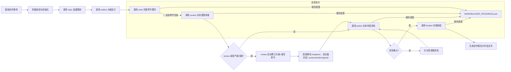

## 网文创作世界构建师 (worldbuilder)

### 触发关键词
我想写小说、写一本网文、从零开始创作小说、帮我写本XX类型的小说、我要写本小说、给我整个小说创作流程、自动写小说、小说创作一站式服务、帮我完成一本小说、我只有创意怎么写小说、从零开始写网文、小说全流程创作

### 核心功能
worldbuilder 是网文创作的一站式主控技能，负责统筹协调从创意萌芽到作品完稿的完整创作链路，构建完整统一的故事世界。通过智能编排各专项技能的调用顺序与参数传递，实现自动化、流水线式的网文创作体验：

1. **选题策划**：调用 `sumeru-topic` 进行市场分析、选题定位，生成核心创意与卖点
2. **大纲设计**：调用 `sumeru-outline` 构建完整世界观、人物设定、分卷大纲与**完整章节细纲**
3. **内容创作**：调用 `sumeru-write` 按大纲进行分章节内容撰写，保持风格统一（**必须完成所有章节后才进入下一阶段**）
4. **逻辑审查**：调用 `sumeru-review` 对**所有已完成章节**进行全面审查，校验时间线一致性、人物行为逻辑、前后剧情连贯性
5. **内容润色**：调用 `sumeru-polish` 对**所有已审查章节**进行文笔优化、细节丰满、节奏调整
6. **完稿校验**：调用 `sumeru-finalize` 对**所有已润色章节**完成错别字检查、标点规范、逻辑漏洞最终排查与作品打包

### ⚠️ 全局约束：子Agent并行处理规则

worldbuilder 在协调所有涉及章节级操作的子技能时，强制执行 AGENTS.md 中定义的**子Agent并行处理规则**：

**每个子Agent最多负责3个章节**（硬性约束，详见 AGENTS.md "子Agent并行处理规则"）

此规则适用于以下所有阶段：
- **写作阶段**（sumeru-write）
- **审查阶段**（sumeru-review）：审查和轻量修复
- **润色阶段**（sumeru-polish）
- **完稿阶段**（sumeru-finalize）
- **细纲生成**（sumeru-outline）

**设计原因**：详见 AGENTS.md "子Agent并行处理规则"

**worldbuilder的调度责任**：
- worldbuilder在调用各子技能时，必须确保子技能遵循3章/Agent的约束
- 如果子技能未自动遵守此约束，worldbuilder需要通过参数或指令强制执行
- 监控子技能的执行过程，确认Agent分配符合约束

### Skill 协调流程

worldbuilder 负责以下数据流转和协调工作：

```
用户需求
    ↓
[收集创作需求 → 保存到 .sumeru/session/requirements.json]
    ↓
[sumeru-topic] 选题策划
    → 输出: 选题策划报告.md, .sumeru/topic/options.json
    ↓
[sumeru-outline] 大纲设计（**生成完整章节细纲**）
    → 输入: .sumeru/topic/options.json (可选)
    → 输出: 小说大纲_*.md, .sumeru/outline/*.json（含 chapter-outlines.json）
    ↓
[阶段检查点 1] 检查大纲完整性，确认章节细纲已生成
    ↓
[sumeru-write] 章节撰写（**细纲驱动，并行批量生成，每个Agent最多3章**）
    → 输入: .sumeru/outline/chapter-outlines.json
    → 输出: chapters/*.md, .sumeru/write/*.json
    → ✅ **必须完成所有章节**（检查章节数与细纲一致）
    → ⚠️ **遵循全局3章/Agent约束**
    ↓
[阶段检查点 2] 验证所有章节已完成，记录写入进度
    ↓
[⚠️ 止损检查点] 评估是否继续（详见"止损判断机制"）
    ↓
[sumeru-review] 逻辑审查（**审查所有章节，自动修订大纲+重写严重问题章节，每个Agent最多3章**）
    → 输入: .sumeru/outline/*.json, chapters/*.md
    → 输出: 剧情审查报告.md, .sumeru/review/*.json（含 outline-revisions.json, bottom-line-checklist.json）
    → ✅ **必须完成全本审查+底线问题零遗漏核验**
    → 🔧 **严重问题自动修订大纲并重写章节，不再只生成 fix-plan.json 等待外部调用**
    → ⚠️ **遵循全局3章/Agent约束**
    ↓
[阶段检查点 3] 验证审查完成，确认底线问题已全部解决或标记「需人工干预」
    ↓
[review 已自动完成大纲修订+章节重写+轻量修复，直接修改了 chapters/（自动备份到 .sumeru/write/original/）]
    ↓
[sumeru-polish] 内容润色（**润色所有章节，每个Agent最多3章**）
    → 输入: chapters/*.md, .sumeru/review/*.json
    → 输出: chapters/*.md（润色后直接修改，自动备份到 .sumeru/write/original/）, .sumeru/polish/*.json
    → ✅ **必须完成全本润色**
    → 📝 **润色结果直接修改 chapters/，修改前自动备份到 .sumeru/write/original/**
    → ⚠️ **遵循全局3章/Agent约束**
    ↓
[阶段检查点 4] 验证润色完成
    ↓
[sumeru-finalize] 完稿校验（**处理所有章节，每个Agent最多3章**）
    → 输入: chapters/*.md（已包含review修复和polish润色后的内容）
    → 输出: publish/*, .sumeru/finalize/*
    → ⚠️ **遵循全局3章/Agent约束**
```

#### 关键阶段检查点说明
每个阶段完成后都会自动更新 `WORKBUILDER_PROGRESS.json`，任务重启时从上次未完成的阶段继续：
- **大纲阶段**：确认 `chapter-outlines.json` 生成且包含完整章节列表
- **创作阶段**：检查 `chapters/` 目录下已生成章节数与细纲一致
- **审查阶段**：确认 `剧情审查报告.md` 生成且包含全本审查结果。review 已自动完成大纲修订、章节重写和轻量修复（直接修改了 `chapters/`，修改前已自动备份到 `.sumeru/write/original/`）。确认 `bottom-line-checklist.json` 中所有底线问题已标记为「已解决」或「需人工干预」
- **润色阶段**：确认润色已直接修改 `chapters/` 中的文件。润色修改前已自动备份到 `.sumeru/write/original/`
- **完稿阶段**：确认 `publish/` 目录下各平台格式导出完成

### 数据共享机制

所有 skill 通过 `.sumeru/` 目录共享数据：
- `session/` - 全局会话配置、用户需求、进度状态
- `topic/` - 选题数据 → 供 outline 使用
- `outline/` - 大纲数据 → 供 write、review 使用
  - **`chapter-outlines.json`** - 完整章节细纲 → **供 write 进行并行批量生成**
- `write/` - 创作进度 → 供 review 使用
- `review/` - 审查问题 → 供 write、polish 使用
- `polish/` - 润色结果 → 供 finalize 使用
- `finalize/` - 完稿数据

### 执行流程


**详细流程说明**：
1. **初始化阶段**：验证输入参数有效性，创建工作目录，初始化创作状态，创建 `WORKBUILDER_PROGRESS.json` 进度文件
2. **需求收集阶段**：智能判断用户提供的信息是否充足，如信息不足则自动触发交互式提问引导用户补充需求，确认所有需求后进入下一阶段
3. **选题阶段**：基于收集到的完整需求生成3-5个精准匹配的选题方案供选择，确定后进入大纲设计，完成后更新进度文件
4. **大纲阶段**：先输出世界观与人设，确认后生成完整大纲和**所有章节细纲**，完成后更新进度文件
5. **创作阶段**：按细纲驱动批量创作所有章节，支持并行生成，**必须完成所有章节**后才进入下一阶段（遵循全局3章/Agent约束）。**当完成15万字（约30-40章）时，自动触发止损检查点，评估是否继续创作**，完成后更新进度文件
6. **审查阶段**：调用 `sumeru-review` 执行三阶段审查修复流程（遵循全局3章/Agent约束）：
    - **第一阶段：全局审查**：分析整体剧情脉络、时间线、设定一致性、冲突点分布、伏笔回收状态，**执行底线问题扫描**生成 `bottom-line-checklist.json`
    - **第二阶段：章节细节审查**：逐章检查字数、时间线、人物OOC、物品状态、场景质量、伏笔设置
    - **第三阶段：统一修复**：
      - 合并全局和章节问题，按严重程度制定修复计划
      - 执行**轻量修复**（文字修正、段落调整、字数填充等），直接修改 `chapters/` 文件（自动备份到 `.sumeru/write/original/`）
      - 对**严重问题自动闭环修复**：修订 `.sumeru/outline/chapter-outlines.json` 中受影响章节的细纲，然后基于修订后的细纲使用子Agent并行重写对应章节，直接修改 `chapters/`（自动备份到 `.sumeru/write/original/`），修订记录保存到 `outline-revisions.json`
      - 执行**底线问题零遗漏核验**：六类底线问题（时间线矛盾、设定崩坏、人物OOC、重复情节、信息泄露、伏笔死结）必须全部解决或标记「需人工干预」
    - **字数检查与填充**：在第二阶段逐章统计字数，对不足的章节自动填充内容（强化场景描写、丰富对话、补充心理活动等）
    - **自动修复所有问题**：不只是提出问题，而是自动修复所有问题（轻量修复+大纲修订+章节重写）
    - review 自动完成大纲修订和章节重写，不再需要 worldbuilder 额外调用 sumeru-write 进行重写
    - 修复完成后重新验证，确保所有问题已解决
    - 完成后更新进度文件
7. **润色阶段**：调用 `sumeru-polish` 进行全本内容润色（遵循全局3章/Agent约束），提供多种润色风格选项（精简/详写/抒情/热血等）
    - 润色完成后，直接修改 `chapters/` 中的文件（修改前自动备份到 `.sumeru/write/original/`）
    - 润色过程和结果记录到 `.sumeru/polish/` 目录
    - 完成后更新进度文件
8. **完稿阶段**：调用 `sumeru-finalize` 对所有润色后的章节进行完稿校验（遵循全局3章/Agent约束），从 `chapters/` 目录读取最终内容（已包含review修复和polish润色后的结果），输出多种格式（Markdown/HTML/EPUB）到 `publish/` 目录，生成创作总结报告，完成后更新进度文件为最终完成状态

### 交互式需求引导
当用户提供的信息过于简略时（仅输入题材和少量关键词），系统会自动触发交互式提问，一步步引导用户明确创作需求，确保生成内容完全符合预期。

#### 提问维度（按优先级）
##### 基础信息确认（必问）
1. 🎯 **题材确认**：确认具体题材细分类型，如"玄幻" → "高武玄幻/修仙玄幻/异世玄幻/系统玄幻"
2. 📏 **篇幅预期**：确认目标字数/章节数，是短篇/中篇/长篇/超长篇
3. 🎯 **核心爽点**：用户最看重的爽点类型，如"打脸/升级/搞钱/恋爱/权谋"
4. 👥 **受众定位**：目标读者群体，男频/女频/全年龄，偏向什么年龄层

##### 核心设定引导（可选，根据需求深度）
5. 🦸 **主角设定偏好**：主角性格（隐忍/张扬/腹黑/逗比）、身份（废柴/天才/穿越者/重生者）、金手指类型偏好
6. 🎭 **反派设定偏好**：反派类型（家族敌人/宗门对手/异族/天道）、反派强度
7. 🌍 **世界观偏好**：偏向什么世界观设定，是否有特别喜欢/讨厌的设定
8. 📖 **参考作品**：是否有类似风格的参考作品，可以更精准匹配风格

##### 风格偏好设置（可选）
9. ✍️ **写作风格**：偏好快节奏爽文/细腻精品文/幽默搞笑文/暗黑压抑文
10. 📱 **发布平台**：计划发布到哪个平台，适配对应平台的节奏和字数要求
11. ⚠️ **禁忌内容**：明确不想要的情节、设定、人物类型
12. 🛑 **止损设置**：是否启用15万字止损检查点？止损阈值是否调整？
13. ⏰ **工作时长**：每天计划投入多少时间？是否需要工作时长管理？

#### 交互模式
- **详细引导模式**：强制开启全量交互式提问，即使用户提供了充足信息也会完整走一遍需求确认流程
- **快速模式**：仅提问最核心的3个问题（题材确认、篇幅、核心爽点），其他使用默认值
- **静默模式**：关闭交互式提问，直接基于已有信息生成，适合明确知道自己需求的用户

#### 需求确认机制
- 所有用户回答自动保存到 `.sumeru/session/user-requirements.json`，全流程各阶段共享使用
- 提问完成后生成**需求确认摘要**，用户确认无误后才开始正式创作
- 支持中途修改，用户可以随时调整之前的回答

#### 引导示例
```
> /worldbuilder 玄幻 "废柴逆袭"
🤖 我来帮您完善创作需求，只需要回答几个简单问题：
1️⃣ 请问您想要的玄幻细分类型是？[高武玄幻/修仙玄幻/异世玄幻/系统玄幻/其他]
> 系统玄幻
2️⃣ 预期总篇幅大概多少字？[20万内/20-50万/50-100万/100万以上]
> 100万以上
3️⃣ 您最看重的核心爽点是？[打脸/升级/扮猪吃虎/收小弟/开后宫/其他]
> 打脸+扮猪吃虎
4️⃣ 主角性格偏好？[隐忍腹黑/张扬霸道/逗比搞笑/温柔沉稳/其他]
> 隐忍腹黑
5️⃣ 有没有特别喜欢的参考作品？比如类似《XX》的风格
> 类似《大王饶命》的搞笑风格
...

✅ 需求收集完成，给您确认一下：
类型：系统玄幻
篇幅：100万字以上
核心爽点：打脸+扮猪吃虎
主角性格：隐忍腹黑
风格参考：《大王饶命》搞笑风
是否确认？[Y/n]
> Y
🚀 开始创作！
```

### 参数说明

创建时需要提供以下信息：
- **作品类型**（必填）：如玄幻、都市、仙侠、科幻、言情、悬疑等
- **核心创意关键词**（必填）：核心创意关键词，支持多个关键词用"+"连接，如"废柴逆袭+系统流+赘婿"

可选信息（不提供则使用默认值或自动生成）：
- **作品标题**：如不提供则自动生成
- **预期篇幅**：短篇（20万字内）/中篇（20-50万字）/长篇（50-100万字）/超长篇（100万字以上），默认中篇
- **写作风格**：快节奏/均衡/详写/文艺，默认均衡
- **整体调性**：幽默/严肃/励志/暗黑，默认中立
- **输出目录**：作品输出目录路径，默认 ./output
- **中断恢复**：传入上次的创作会话ID，可从断点恢复
- **跳过阶段**：跳过指定阶段（topic/outline/write/review/polish/final），适用于续创或团队分工
- **止损阈值**：默认15万字，可自定义（如10万字/20万字）
- **止损评估**：是否启用止损检查点（默认启用）
- **工作模式**：标准2小时块/深度6小时块/自定义
- **每日时长**：默认不超过6小时，可自定义

### 使用示例

#### 基础使用
```
# 最简单的调用方式，只指定类型和关键词
/worldbuilder 玄幻 "废柴逆袭+系统流"

# 都市言情作品，指定标题
/worldbuilder 言情 "霸道总裁+契约恋爱" 标题"总裁的契约新娘"

# 科幻悬疑，长篇幅，快节奏风格
/worldbuilder 科幻 "时间循环+密室解谜" 长篇 快节奏
```

#### 进阶使用
```
# 指定详细参数的完整调用
/worldbuilder 仙侠 "重生+无敌流+宗门" 标题"重生之太上掌门" 长篇 详写风格 励志调性

# 从中断点恢复创作
/worldbuilder 玄幻 "废柴逆袭+系统流" 恢复上次创作

# 跳过选题阶段，直接从已有大纲继续创作
/worldbuilder 都市 "职场+重生" 跳过选题阶段
```

#### 多风格组合
```
# 幽默风都市修仙
/worldbuilder 都市 "修仙+打工+搞笑" 均衡风格 幽默调性

# 暗黑系悬疑推理
/worldbuilder 悬疑 "连环杀人+心理侧写+反转" 详写风格 暗黑调性

# 热血励志竞技
/worldbuilder 竞技 "篮球+天赋+逆袭" 快节奏 励志调性
```

### 错误处理说明

#### 常见错误类型与解决方案

| 错误代码 | 错误信息 | 原因分析 | 解决方案 |
|----------|----------|----------|----------|
| `INVALID_GENRE` | 不支持的作品类型 | 传入的 genre 参数不在支持列表中 | 检查类型拼写，支持的类型：玄幻、都市、仙侠、科幻、言情、悬疑、历史、游戏、竞技、军事、武侠、轻小说 |
| `KEYWORDS_TOO_LONG` | 关键词过长 | keywords 参数超过100字符限制 | 精简关键词，保留最核心的3-5个 |
| `DEPENDENCY_MISSING` | 缺少依赖技能 | 未安装所需的子技能（topic等） | 运行 `/find-skills ` 查找并安装所有依赖技能 |
| `OUTPUT_DIR_PERMISSION` | 输出目录无权限 | 指定的 output-dir 无写入权限 | 更换有权限的目录，或使用默认目录 |
| `INVALID_SESSION_ID` | 无效的会话ID | resume 参数传入的会话ID不存在 | 检查会话ID是否正确，或重新开始创作 |
| `STAGE_SKIP_CONFLICT` | 阶段跳过冲突 | 跳过的阶段与后续阶段有依赖关系 | 移除对前置阶段的跳过，或提供必要的前置文件 |
| `CONTENT_GENERATION_FAILED` | 内容生成失败 | 创作过程中遇到内容审核或模型限制 | 调整关键词或风格参数，或分阶段手动确认 |

#### 错误恢复机制
- **自动重试**：对于临时性网络错误，自动重试3次，间隔5秒
- **断点保存**：每完成一个阶段自动保存状态，支持从中断点恢复
- **回滚选项**：对不满意的阶段可选择回滚到上一节点重新开始
- **错误报告**：生成详细的错误日志文件，位于 `{output-dir}/error.log`

### 止损判断机制（15万字检查点）

#### 为什么需要止损

网文创作是商业行为，不是纯文学创作。写到15万字后，如果数据和创作状态都不理想，继续投入只会浪费更多时间和精力。及时止损，把经验迁移到下一本书，才是正确的策略。

#### 止损检查点触发条件

当满足以下任一条件时，自动触发止损检查：
1. **字数达到15万字**（约30-40章）
2. **用户主动请求止损评估**
3. **创作过程中遇到重大问题**（如连续3章卡壳、设定崩坏无法修复等）

#### 止损评估维度

触发止损检查点后，从以下维度评估是否继续：

| 评估维度 | 继续标准 | 止损信号 |
|----------|---------|---------|
| **题材适配性** | 题材在目标平台有大量同类读者 | 题材冷门，平台无类似爆款 |
| **开篇质量** | 前3章能迅速给出强卖点 | 前3章平淡，没有抓住读者 |
| **主角目标** | 主角目标明确且有驱动力 | 主角目标模糊，读者不知道期待什么 |
| **爽点循环** | 30章内形成稳定爽点循环 | 爽点稀疏，读者失去兴趣 |
| **人物张力** | 人物关系有张力，读者关心角色命运 | 人物扁平，读者不在乎 |
| **长期期待** | 后续剧情有长期期待感 | 后续剧情缺乏吸引力 |
| **创作热情** | 自己对这个题材还有热情 | 自己已经厌倦，写不下去 |

#### 止损决策流程

```
触发止损检查点
    ↓
加载评估维度表，逐项打分（1-10分）
    ↓
计算综合得分
    ↓
[综合得分 ≥ 6分] → 继续创作，更新进度文件
    ↓
[综合得分 < 6分] → 进入止损流程
```

#### 止损执行流程

当决定止损时，执行以下步骤：

**第一步：保存当前进度**
```json
{
  "stopLoss": {
    "triggeredAt": "2026-06-16T10:00:00",
    "totalWords": 150000,
    "totalChapters": 35,
    "evaluationScore": 4.5,
    "stopReason": "题材在番茄平台表现不佳，爽点循环未形成"
  }
}
```

**第二步：生成止损复盘报告**

```markdown
# 止损复盘报告

## 基本信息
- 书名：
- 题材：
- 目标平台：
- 总字数：
- 总章节数：
- 止损时间：

## 评估结果
| 维度 | 得分 | 说明 |
|------|------|------|
| 题材适配性 | X/10 | |
| 开篇质量 | X/10 | |
| 主角目标 | X/10 | |
| 爽点循环 | X/10 | |
| 人物张力 | X/10 | |
| 长期期待 | X/10 | |
| 创作热情 | X/10 | |
| **综合得分** | **X/10** | |

## 问题诊断
1. **最大问题**：
2. **次要问题**：
3. **潜在问题**：

## 经验提炼
1. **可保留的经验**：
2. **需避开的坑**：
3. **可迁移到下一本书的结构**：

## 下一步建议
1. **下一本书方向**：
2. **需要改进的点**：
3. **建议测试的题材**：
```

**第三步：用户确认**
- 展示止损复盘报告
- 用户确认后，保存报告到 `.sumeru/session/stop-loss-report.md`
- 标记项目状态为 `stopped`

**第四步：经验迁移**
- 将止损复盘中的"可迁移结构"提取到 `.sumeru/session/migratable-structures.json`
- 下一次开书时，自动加载这些经验

#### 止损后的项目状态

止损后，项目状态标记为 `stopped`，不再执行后续的 review/polish/finalize 阶段。

项目目录结构保留：
```
.sumeru/
├── session/
│   ├── status.json          # 状态：stopped
│   ├── stop-loss-report.md  # 止损复盘报告
│   └── migratable-structures.json  # 可迁移结构
├── outline/                 # 保留大纲（供复盘参考）
├── write/                   # 保留已写章节（供复盘参考）
└── ...
```

#### 止损后的操作选项

| 操作 | 说明 |
|------|------|
| `重新评估` | 修改评估分数，决定是否继续 |
| `修改大纲` | 调整大纲后重新评估 |
| `切换平台` | 换一个平台重新试水 |
| `开始新书` | 保留经验，开始下一个项目 |
| `导出复盘` | 将止损复盘报告导出为Markdown文件 |

### 工作时长管理

#### 为什么需要管理时长

网文创作是长期工作，需要稳定输出。方法论建议：
- 标准2小时拆书块：适合普通日常，目标是稳定输入，不把自己耗干
- 深度6小时块：适合状态好、时间充足的日子，但单日尽量不要超过6小时，避免透支

#### 工作模式选择

| 模式 | 时长 | 适用场景 | 产出要求 |
|------|------|---------|---------|
| **标准2小时块** | 2小时 | 普通日常 | 4项最小产出 |
| **深度6小时块** | 6小时 | 状态好、时间充足 | 4项深度产出 |
| **自定义** | 用户设定 | 灵活安排 | 用户自定 |

#### 标准2小时拆书块

适合普通日常，目标是稳定输入，不把自己耗干。

**时间分配**：
```
00:00-00:10 选书：看榜单、标签、简介、评论区
00:10-00:40 阅读：集中看 1-3 章或一个关键剧情段
00:40-01:10 手动记录：剧情推进、人物关系、爽点、钩子
01:10-01:35 AI 拆解：把不懂的地方交给 DeepSeek/Claude 分析
01:35-01:50 二次判断：提炼可迁移结构，剔除不能照搬内容
01:50-02:00 沉淀：写入 Markdown/Obsidian，并标注标签
```

**2小时结束必须有产出**：
- 至少 1 条可复用结构
- 至少 1 个可迁移爽点
- 至少 1 个章节钩子写法
- 至少 1 条给自己作品的启发

#### 深度6小时块

适合状态好、时间充足的日子，但单日尽量不要超过6小时，避免透支。

**时间分配**：
```
第 1 小时：选书与快速判断
第 2 小时：阅读前 10 章
第 3 小时：拆开篇、金手指、主角目标、冲突
第 4 小时：拆人物关系、爽点循环、伏笔
第 5 小时：写一段 1000-2000 字迁移样章
第 6 小时：复盘并沉淀到 Obsidian
```

**深度块结束必须有产出**：
- 一份完整拆书笔记
- 一段迁移样章
- 一个可复用题材假设
- 一个可以测试的番茄开篇方向

#### 工作时长追踪

每次创作会话记录工作时长：

```json
{
  "workSession": {
    "startTime": "2026-06-16T10:00:00",
    "endTime": "2026-06-16T12:00:00",
    "duration": 120,
    "mode": "standard-2h",
    "tasks": [
      {
        "task": "拆书分析",
        "duration": 60,
        "output": "《书名》拆书笔记"
      },
      {
        "task": "样章写作",
        "duration": 60,
        "output": "第1章草稿"
      }
    ],
    "产出检查": {
      "可复用结构": true,
      "可迁移爽点": true,
      "章节钩子写法": true,
      "给自己作品的启发": true
    }
  }
}
```

#### 时长提醒机制

- **标准2小时块**：2小时后自动提醒"本次工作时长已达2小时，请检查产出是否达标"
- **深度6小时块**：每2小时提醒一次工作进度，6小时后强制提醒"今日工作时长已达6小时，建议休息"
- **超时警告**：超过8小时后警告"工作时长过长，可能影响创作质量和身体健康"

#### 每周工作时长建议

| 工作日 | 建议时长 | 工作内容 |
|--------|---------|---------|
| 周一 | 2小时 | 拆书分析 |
| 周二 | 2小时 | 拆书分析 |
| 周三 | 2小时 | 样章写作 |
| 周四 | 2小时 | 拆书分析 |
| 周五 | 2小时 | 样章写作 |
| 周六 | 4-6小时 | 深度创作 |
| 周日 | 休息 | 复盘总结 |

**每周总时长建议**：12-16小时，不超过20小时

### 进阶使用场景

#### 场景1：团队协作创作
```
# 策划完成选题和大纲后，交由写手继续
/worldbuilder 玄幻 "废柴逆袭+系统流" 跳过写作、审查、润色、完稿阶段

# 写手接手，从创作阶段继续
/worldbuilder 玄幻 "废柴逆袭+系统流" 跳过选题、大纲阶段 恢复上次创作
```

#### 场景2：多版本对比创作
```
# 生成多个版本进行对比
/worldbuilder 言情 "穿越+宫斗" 标题"清宫·甄嬛传" 文艺风格
/worldbuilder 言情 "穿越+宫斗" 标题"清宫·步步惊心" 快节奏
```

#### 场景3：定制化系列作品
```
# 第一部
/worldbuilder 玄幻 "系统+升级" 标题"武帝降临" 中篇

# 第二部（沿用世界观）
/worldbuilder 玄幻 "系统+升级" 跳过选题、大纲阶段 恢复上次创作 标题"武帝降临2"
```

#### 场景4：A/B测试优化
```
# 测试不同开篇风格
/worldbuilder 都市 "重生+商战" 跳过写作、审查、润色、完稿阶段
# 手动修改大纲中的开篇设定后继续
/worldbuilder 都市 "重生+商战" 跳过选题阶段 恢复上次创作
```

#### 场景5：批量生成素材库
```
# 生成多个选题方案用于后续选择
/worldbuilder 玄幻 "废柴" 跳过大纲、写作、审查、润色、完稿阶段
/worldbuilder 玄幻 "系统" 跳过大纲、写作、审查、润色、完稿阶段
/worldbuilder 玄幻 "重生" 跳过大纲、写作、审查、润色、完稿阶段
```

#### 数据持久化规范
所有中间状态数据统一存储在当前工作目录的 `.sumeru/` 目录下，避免上下文压缩或清理导致数据丢失：

#### 全局存储结构
```
.sumeru/
├── session/          # 会话全局数据
│   ├── config.json   # 创作配置参数
│   ├── status.json   # 当前进度状态
│   ├── history.log   # 操作历史记录
│   ├── stop-loss-report.md  # 止损复盘报告（止损后生成）
│   └── migratable-structures.json  # 可迁移结构（止损后生成）
├── topic/            # 选题阶段输出
│   ├── report.md     # 完整选题策划报告
│   └── options.json  # 多选题方案原始数据
├── outline/          # 大纲阶段输出
│   ├── world.md      # 世界观设定
│   ├── characters.json # 人物设定卡
│   ├── plot.md       # 剧情大纲
│   ├── plot-outline.json # 剧情大纲结构化数据
│   └── chapter-outlines.json # **完整章节细纲（核心输出）**
├── write/            # 创作阶段输出
│   ├── draft/        # 章节草稿
│   ├── original/     # 原始章节备份（review/polish修改前自动备份）
│   └── progress.json # 创作进度跟踪
├── review/           # 审查阶段输出
│   ├── timeline.json # 时间线数据
│   ├── issues.json   # 问题清单
│   ├── fix-plan.json # 修复计划
│   ├── outline-revisions.json # 大纲修订记录
│   ├── bottom-line-checklist.json # 底线问题清单
│   ├── rewrite-chapters/ # 重写章节修订记录
│   └── plot-map.json # 剧情脉络图
├── polish/           # 润色阶段输出
│   └── diff.json     # 修改对比记录
└── finalize/         # 完稿阶段输出
    ├── clean/        # 纯净版全文
    ├── platforms/    # 各平台导出版本
    └── report.md     # 完稿校验报告
```

#### 进度保存机制（WORKBUILDER_PROGRESS.json）

```json
{
  "session_id": "session-20260616-abc123",
  "created_at": "2026-06-16T10:00:00",
  "updated_at": "2026-06-16T14:30:00",
  "current_stage": "review",
  "stages": {
    "topic": {
      "status": "completed",
      "completed_at": "2026-06-16T10:15:00",
      "output_files": [
        "选题策划报告.md",
        ".sumeru/topic/options.json"
      ]
    },
    "outline": {
      "status": "completed", 
      "completed_at": "2026-06-16T11:20:00",
      "output_files": [
        "小说大纲_玄幻系统流.md",
        ".sumeru/outline/chapter-outlines.json"
      ]
    },
    "write": {
      "status": "completed",
      "completed_at": "2026-06-16T13:45:00",
      "output_files": [
        "chapters/001-废物觉醒系统.md",
        "chapters/002-系统签到奖励.md",
        ".sumeru/write/progress.json"
      ],
      "statistics": {
        "total_chapters": 100,
        "completed_chapters": 100,
        "total_words": 520000
      }
    },
    "review": {
      "status": "completed",
      "completed_at": "2026-06-16T14:45:00",
      "output_files": [
        "剧情审查报告.md",
        ".sumeru/review/issues.json",
        ".sumeru/review/fix-plan.json",
        ".sumeru/review/outline-revisions.json",
        ".sumeru/review/bottom-line-checklist.json"
      ],
      "statistics": {
        "total_issues_found": 8,
        "critical_issues": 2,
        "issues_fixed_lightweight": 4,
        "issues_fixed_rewrite": 2,
        "outline_revisions": 1,
        "bottom_line_resolved": 2,
        "bottom_line_manual": 0
      },
      "outline_revised": true,
      "chapters_rewritten": true,
      "bottom_line_all_resolved": true
    },
    "polish": {
      "status": "in_progress",
      "started_at": "2026-06-16T15:00:00",
      "progress": "60%",
      "polish_level": "moderate",
      "style": "小白爽文"
    },
    "finalize": {
      "status": "pending"
    }
  },
  "stopLoss": {
    "enabled": true,
    "threshold": 150000,
    "checkpoints": [
      {
        "chapter": 35,
        "words": 152000,
        "evaluatedAt": "2026-06-16T14:00:00",
        "score": 7.2,
        "decision": "continue",
        "reason": "题材适配性好，爽点循环已形成"
      }
    ]
  }
}
```

#### 数据生命周期管理
1. **自动保存**：每完成一个阶段自动将数据写入对应目录，支持幂等写入
2. **进度追踪**：每个阶段完成后自动更新 `WORKBUILDER_PROGRESS.json`，记录阶段状态与完成时间
3. **版本控制**：关键节点自动生成版本快照，命名格式 `{stage}-{timestamp}.json`
4. **断点恢复**：恢复创作时自动从 `.sumeru/` 目录读取对应阶段数据
5. **清理规则**：支持清理所有中间数据，默认保留最近3个版本
6. **数据复用**：可直接引用其他项目的 `.sumeru/` 目录数据，实现世界观/人设复用

### 内置参考资源库
worldbuilder 技能内置参考资源库，位于 `references/` 目录下：

| 参考文件 | 内容说明 | 适用场景 |
|---------|---------|----------|
| `skill-boundary-matrix.md` | 技能边界矩阵，包含体系定位、功能边界、调用规则、场景选择指南 | 理解技能体系架构、选择合适技能、解决技能调用问题 |
| `glossary.md` | 术语表，定义网文创作、质量控制、技术实现等关键术语 | 理解专业术语、统一团队沟通语言、查阅概念定义 |

### 高级配置：自定义阶段钩子
通过配置文件 `{output-dir}/hooks.json` 可以在各阶段前后插入自定义处理：
```json
{
  "before_topic": "my-preprocess-script.sh",
  "after_outline": "validate-outline.js",
  "before_write": "setup-write-env.py",
  "after_final": "deploy-to-platform.sh"
}
```
