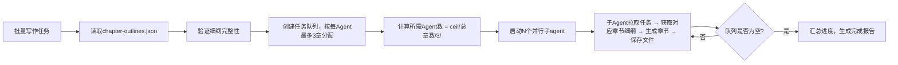

## 网文章节撰写

### 触发关键词
帮我写一章小说、续写接下来的内容、生成XX情节、批量写网文章节、扩写/重写这段内容、帮我写个XX情节、续写小说、把这段内容扩写、重写这一章、批量生成小说章节、写个开篇章节、写个高潮情节、小说内容生成、帮我写小说内容、网文章节生成、从细纲生成章节、按细纲写小说、批量生成所有章节、细纲驱动写作

### 核心功能
1. **基于完整细纲生成**：自动读取 `.sumeru/outline/chapter-outlines.json`，根据细纲批量生成章节
2. **智能细纲匹配**：支持按章节号、卷号、或全部章节进行生成
3. 基于大纲和细纲生成完整章节内容
4. 自动适配网文节奏：开头抓眼球、中间有冲突、结尾留悬念
5. 保持人物性格、剧情逻辑的一致性
6. 支持自定义章节长度（默认4000-5000字/章）
7. 支持续写、修改、调整已有章节内容

### 续写规则

#### 续写模式
支持续写、重写、扩写、精简等多种模式

#### ⚠️ 读者偏好硬约束（每章必检，违反任一条即为不合格）

以下7条来自方法论的读者偏好假设，是网文商业写作的底层要求。每章生成后必须逐条自检，任一条未达标需修改后重新输出。

**1. 开篇快（前1000字硬约束）**
- 前1000字内必须出现以下至少2项：
  - 主角处境（当前困境/身份/处境）
  - 核心矛盾（与他人的冲突/与环境的冲突/内心挣扎）
  - 金手指或关键道具
  - 强情绪（愤怒/委屈/期待/恐惧/兴奋）
- ❌ 禁止：大段景物描写、背景介绍、无关人物出场、回忆闪回

**2. 目标明**
- 本章必须有明确的主线目标或阶段性目标
- 主角必须清楚自己想要什么（即使目标在本章发生变化）
- 读者必须清楚接下来期待什么
- ❌ 禁止：无目的漫游、无意义对话、与主线无关的支线

**3. 爽点密**
- 每章至少1个爽点，爽点类型从以下选择：
  - 升级爽（实力突破、技能解锁）
  - 打脸爽（反派轻视→主角实力打脸）
  - 收获爽（获得宝物/功法/资源/人脉）
  - 身份爽（身份曝光、地位提升、被尊重）
  - 情感爽（感情升温、信任建立、误会化解）
  - 智力爽（布局成功、计谋得逞、真相揭露）
  - 探索爽（发现秘境、解锁真相、获得新信息）
- 爽点必须形成循环：铺垫→蓄力→爆发→余韵

**4. 情绪强**
- 本章必须有情绪变化曲线（不能平）
- 推荐情绪节奏：压抑→期待→释放→新悬念
- 每个场景都要有明确的情绪标签（紧张/轻松/热血/温情/压抑/兴奋）
- ❌ 禁止：全程平淡叙述、无情绪起伏

**5. 人设清**
- 出场人物必须一出场就有鲜明功能
- 功能分类：主角/反派/导师/伙伴/对手/红颜/工具人
- 每个人物必须有可识别的性格标签（3-5个关键词）
- ❌ 禁止：无功能的路人角色、性格模糊的角色

**6. 章节钩子硬**
- 每章结尾必须留下以下至少1项：
  - 新问题/新危机
  - 意外反转
  - 人物误会
  - 奖励/好处
  - 新目标/新期待
- 钩子必须具体，不能是模糊的"事情变得更复杂了"
- ❌ 禁止：平淡收尾、无悬念结尾、"且听下回分解"式结尾

**7. 短剧感强**
- 冲突必须外显（不能只在内心）
- 关系张力必须强（爱恨分明、立场对立）
- 场面必须容易脑补（有画面感、有动作、有对话）
- 每章都要有可改编为短剧/漫画的高光时刻

#### 每章写作检查表（生成后自检）

每章写完后，逐项打勾：

- [ ] 前1000字是否出现处境/矛盾/金手指/强情绪（至少2项）？
- [ ] 本章是否有明确目标？主角是否知道自己想要什么？
- [ ] 本章是否有至少1个爽点？爽点是否形成循环？
- [ ] 本章情绪是否有变化曲线？不能平。
- [ ] 出场人物是否有鲜明功能？是否有可识别的性格标签？
- [ ] 章末是否留下具体钩子（问题/危机/反转/奖励/新目标）？
- [ ] 本章是否有短剧感高光时刻（冲突外显、关系张力、画面感）？

**任一项未通过，必须修改后重新输出。**

#### 续写注意事项
1. 保持人物性格一致性，不OOC（Out Of Character）
2. 保持前文设定的战力体系、世界观不崩坏
3. 伏笔回收要自然，不突兀
4. 语言风格与前文保持统一
5. 承接上文剧情，开启下文伏笔
6. 如已有章节内容不完整，优先补完

#### 多章生成
支持连续生成多章内容，自动按章节顺序生成

### 细纲驱动批量生成

#### 自动读取细纲模式
当 `.sumeru/outline/chapter-outlines.json` 存在时，自动启用细纲驱动模式：

```bash
# 生成所有章节（读取细纲，自动并行）
/sumeru-write 全部章节

# 生成指定范围章节
/sumeru-write 第1-50章

# 生成特定卷的所有章节
/sumeru-write 第1卷

# 生成特定章节
/sumeru-write 第3章,第5章,第10章

# 批量并行创作指定范围
/sumeru-write 第1-100章 批量并行
```

#### 细纲输入格式支持

支持直接传入单章细纲：

```bash
# 使用自然语言描述生成单章
/sumeru-write 第3章 "主角在拍卖会上获得神秘功法"

# 基于已有细纲生成
/sumeru-write 第3章 按细纲生成
```

#### 细纲数据结构验证

生成前自动验证细纲完整性：
- 检查必填字段是否存在
- 验证人物名称是否在characters.json中定义
- 检查场景地点是否在world.json中定义
- 提供缺失信息的补充建议

#### 子agent并行批量写作（大量章节推荐）
当需要一次性生成大量章节（>3章）或使用细纲驱动模式时，自动启用子agent模式：

**⚠️ 遵循全局约束：每个子Agent最多负责3个章节**（详见 AGENTS.md "子Agent并行处理规则"）
- 所需Agent数 = ceil(总章节数 / 3)，调度器自动计算
- 相邻章节分配给同一Agent，保持上下文连贯性

**核心优势**
- ✅ **细纲隔离**：每个子agent只获取自己负责章节的细纲，避免上下文溢出
- ✅ **3章上限保障**：每个Agent最多3章，确保生成质量和一致性
- ✅ 上下文隔离：每个子agent不携带历史章节内容，彻底解决长上下文压缩/溢出问题
- ✅ 速度提升：多并行写作，速度是串行的N倍
- ✅ 错误隔离：单章生成失败不影响其他章节，自动重试失败章节
- ✅ 内存优化：子agent完成后自动销毁，释放内存资源
- ✅ 增量写入：每写完一章立即保存到`.sumeru/write/draft/`，无需等待全部完成
- ✅ **进度可视化**：实时显示已完成/进行中/待写章节状态

**调度逻辑（细纲驱动）**


**章节分配规则**
- 按章节顺序连续分配，如Agent1负责第1-3章，Agent2负责第4-6章，以此类推
- 尾部不足3章的Agent按实际剩余章节数分配
- 相邻章节分配给同一Agent，以保持上下文连贯性

**子agent输入上下文**
- 完整章节内容，符合指定风格与节奏
- 下一章内容预告/思路建议
- 本章剧情关键点梳理
- 本章埋设的伏笔提示（可选）
- 人物成长/变化摘要（可选）

### 章节质量门禁（每章必过）

#### 门禁模式选择

| 模式 | 门禁复杂度 | 适用场景 | 检查项数量 |
|------|-----------|---------|-----------|
| **新手模式** | 轻量 | 快速试错、短篇创作 | 8项 |
| **标准模式** | 完整 | 中篇创作、日常连载 | 14项 |
| **严格模式** | 完整+精细 | 长篇连载、精品创作 | 14项+自检报告 |

**默认模式**：新手模式（适合初学者和快速试错）

#### 新手模式门禁（8问检查表）

每章写完后，逐项打勾：

- [ ] **目标明确**：这一章有没有明确目标？
- [ ] **冲突存在**：有没有冲突或阻力？
- [ ] **情绪变化**：有没有情绪变化（不能平）？
- [ ] **爽点/期待**：有没有爽点或期待感？
- [ ] **推进主线**：有没有推进主线？
- [ ] **强化人物**：有没有强化人物（性格/关系/成长）？
- [ ] **伏笔埋设**：有没有埋伏笔或回收伏笔？
- [ ] **章末钩子**：结尾有没有让人想看下一章？

**通过标准**：8项全部打勾 → 通过；任一项未打勾 → 需修改

#### 标准模式门禁（14项检查）

每章生成后，必须通过以下质量门禁才能输出：

| 检查项 | 标准 | 不通过处理 |
|--------|------|-----------|
| 开篇速度 | 前1000字出现处境/矛盾/金手指/强情绪≥2项 | 重写开篇 |
| 目标明确性 | 本章有明确目标，主角知道想要什么 | 补充目标线 |
| 爽点密度 | 至少1个爽点，形成铺垫→蓄力→爆发→余韵循环 | 补充爽点 |
| 情绪曲线 | 有情绪变化，不能全程平淡 | 调整情绪节奏 |
| 人设清晰度 | 出场人物有鲜明功能和性格标签 | 强化人物功能 |
| 章末钩子 | 结尾留下具体钩子（非模糊悬念） | 改写结尾 |
| 短剧感 | 有冲突外显、关系张力、画面感的高光时刻 | 增加高光场景 |
| 推进主线 | 剧情有实质性推进，不能原地踏步 | 调整剧情走向 |
| 强化人物 | 人物有成长/变化/关系推进 | 强化人物弧光 |
| 伏笔埋设 | 新埋伏笔或回收旧伏笔 | 补充伏笔 |
| 设定一致 | 不违反已有设定 | 修正设定冲突 |
| 节奏合理 | 快慢交替，不能一直快或一直慢 | 调整节奏 |
| 对话自然 | 对话符合人物性格，不千人一面 | 优化对话 |
| 章节长度 | 字数在合理范围内（2000-5000字） | 调整篇幅 |

#### 严格模式门禁（14项+自检报告）

在标准模式基础上，额外要求：
- 输出自检报告（按7项读者偏好硬约束逐项打分）
- 每3章做一次风格校准
- 每5章做一次一致性检查

#### 自检输出格式

每章输出时，附带以下自检报告（可选，用户要求时输出）：

```markdown
---
## 本章自检报告

| 检查项 | 状态 | 说明 |
|--------|------|------|
| 开篇速度 | ✅/❌ | 前1000字出现：处境✓ 矛盾✓ |
| 目标明确性 | ✅/❌ | 本章目标：XXX |
| 爽点密度 | ✅/❌ | 爽点类型：打脸爽，位置：第X段 |
| 情绪曲线 | ✅/❌ | 情绪变化：压抑→期待→释放 |
| 人设清晰度 | ✅/❌ | 出场人物：主角/反派/配角，功能明确 |
| 章末钩子 | ✅/❌ | 钩子内容：XXX |
| 短剧感 | ✅/❌ | 高光时刻：XXX |

**综合评分：X/7 通过**
---
```

### 章末钩子模板（6种常用结构）

每章结尾必须从以下6种结构中选择1种，确保钩子具体有效：

#### 结构1：危机钩子
```
场景收束 → 新威胁出现（具体的敌人/事件/信息）→ 主角反应（震惊/警惕/恐惧）→ 章末
```
示例：`她刚松了一口气，门外忽然传来急促的脚步声——是赵七，他的脸色很难看。`

#### 结构2：反转钩子
```
信息揭露 → 与之前认知冲突 → 主角/读者认知颠覆 → 章末
```
示例：`她盯着那块玉佩，心脏猛地跳了一拍——这个符号，她在灭门案现场见过。`

#### 结构3：误会钩子
```
角色A获得信息 → 角色B不知道A知道 → 信息差形成张力 → 章末
```
示例：`萧衍盯着她看了几秒，眼神里闪过一丝复杂的情绪——他不知道，她已经知道了那个秘密。`

#### 结构4：奖励钩子
```
主角获得好处/资源/信息 → 好处的具体价值 → 新的可能性 → 章末
```
示例：`她低头看着手里的令牌，嘴角微微上扬——有了这个，她就能进入藏书阁了。`

#### 结构5：目标钩子
```
旧目标完成/受阻 → 新目标出现（具体、可执行）→ 主角下定决心 → 章末
```
示例：`她深吸一口气，转身往摄政王府的方向走去——明天，她要拿到三年前灭门案的资料。`

#### 结构6：承诺钩子
```
角色A对角色B做出承诺/约定 → 承诺的具体内容 → 期待感 → 章末
```
示例：`萧衍的声音从身后传来："明天。你来。"她的脚步僵住了。`

### 章节文件命名规范

**强制格式：`{三位章节号}-{章节标题}.md`**

| 规则 | 说明 | 示例 |
|------|------|------|
| 章节号 | 三位数字零填充 | `001`、`003`、`042`、`128` |
| 分隔符 | 英文短横线 `-` | `-` |
| 标题 | 章节标题原文，不含特殊字符 | `第一次解析`、`废物觉醒系统` |
| 扩展名 | `.md` | `.md` |

**命名示例：**
```
003-第一次解析.md
001-废物觉醒系统.md
042-时间线冲突.md
128-终极决战.md
```

**❌ 错误命名：**
```
第3章-第一次解析.md    # 不要加"第X章"前缀
3-第一次解析.md         # 章节号必须三位零填充
003_第一次解析.md       # 分隔符是短横线，不是下划线
003-第一次解析.txt      # 扩展名必须是.md
003第一次解析.md        # 必须有短横线分隔符
```

### 数据持久化
#### 正式输出（用户可见）
- 生成的章节默认保存到当前工作目录的 `chapters/` 下，严格遵循上述命名规范
- 章节文件为纯净的正文内容，不含任何中间标记和元数据，用户可直接阅读、编辑
- 支持自定义章节输出目录
- **批量生成进度报告**：`chapters/WRITE_PROGRESS.md`（实时更新）

#### 中间过程数据（仅系统内部使用）
所有中间状态、元数据、进度信息统一保存到 `.sumeru/write/` 目录：
- `progress.json`：创作进度跟踪，包含已完成章节、字数统计、各章节状态
- `chapter-meta.json`：每章元数据，包含核心事件、出场人物、爽点位置、伏笔记录
- `character-state.json`：人物状态动态跟踪，记录各时间点人物能力、关系、状态变化
- `used-outlines.json`：已使用的章节细纲记录，支持增量生成
- `original/`：原始章节文件备份目录。当 review 或 polish 修改 `chapters/` 文件时，原始章节文件会先自动备份到 `.sumeru/write/original/` 目录，确保可回滚

#### 与其他 Skill 配合
- **前置 Skill**：自动读取 `.sumeru/outline/` 目录的大纲数据
  - 使用 `characters.json` 保持人物性格一致性
  - 使用 `chapter-outlines.json` 中的**完整章节细纲**驱动批量生成
  - 使用 `world.json` 保持世界观设定一致性
- **后续 Skill**：生成的章节数据可供 `sumeru-review`、`sumeru-polish`、`sumeru-finalize` 使用

#### 相关文档
- [技能边界矩阵](../sumeru-worldbuilder/references/skill-boundary-matrix.md) - 理解本技能在体系中的定位与功能边界
- [术语表](../sumeru-worldbuilder/references/glossary.md) - 查阅"爽点"、"章节钩子"、"细纲驱动"等关键术语定义

#### 断点恢复
- 每次任务启动时读取 `chapters/` 目录下已存在的章节文件和 `.sumeru/write/progress.json` 进度
- 读取 `.sumeru/outline/chapter-outlines.json` 获取完整细纲
- 从最新未完成章节继续，自动跳过已生成的章节
- 支持从指定章节恢复创作
- 支持只生成缺失的章节（增量模式）
